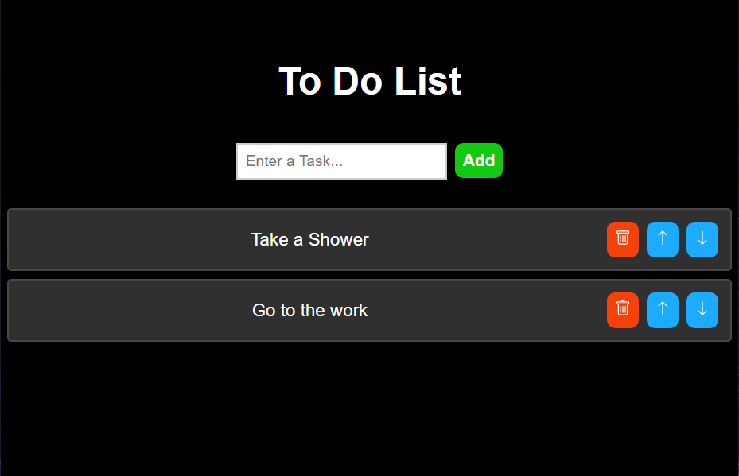

# To-Do List

This is a simple and efficient "To-Do List" application built with Vite and React. It allows users to add, delete, and rearrange tasks with ease.

  

## Description
The project is a user-friendly application that helps in organizing your daily tasks. It provides a clean interface to add new tasks, delete completed ones, and even rearrange them as per priority.

## Features
- Add new tasks to the list by pressing the "Enter" key or clicking the "Add" button.
- Select tasks by clicking.
- Delete tasks when completed.
- Rearrange the order of the tasks.
- Use keyboard keys to delete or rearrange tasks.
- Deselect tasks by clicking on a blank space.
- Clean and intuitive UI

## Installation and Setup

• Node.js and npm (or yarn) installed on your system.

Steps:

1. Clone this repository:
    git clone https://github.com/rohanvron/To-Do-List.git

2. Navigate to the project directory: 
    cd To-Do-List

3. Install dependencies:
    npm install

## Technologies Used

React: JavaScript library for building user interfaces
Vite: Modern build tool for developing and optimizing web applications(Javascript, Html, Css)

## Contributing

Pull requests are welcome for bug fixes, improvements, or new features. Please create an issue first to discuss your proposed changes before submitting a pull request.

**Functionality Enhancements**

Feel free to contribute to this project by adding functionalities like:

- Implement task editing feature.
- Assign priority levels (high, medium, low) to tasks for better organization.
- Mark tasks as completed with a visual indicator (checkbox, strikethrough).
- Implement drag-and-drop interaction for reordering tasks in the list

**UI/UX Improvements:**

- Introduce themes or dark mode.
- Improve task display layout.
- Add subtle animations.

## License

This project is licensed under the MIT License. See the `LICENSE` file for more details.

Check Out the <a href="https://rohanvron.github.io/To-Do-List/"> DEMO </a>